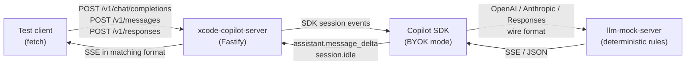

# Integration test architecture

The integration tests verify the full request pipeline. An HTTP client sends a request to the proxy, the proxy creates a Copilot SDK session that talks to a mock LLM server, and the proxy streams the response back in the correct SSE format.



## How it works

The Copilot SDK supports [BYOK (Bring Your Own Key)](https://github.com/github/copilot-sdk) providers. Instead of talking to GitHub's backend, the SDK sends requests to a custom endpoint. We point it at [`llm-mock-server`](https://github.com/theblixguy/llm-mock-server), which returns deterministic responses based on pattern-matching rules.

This means the tests exercise the real SDK session lifecycle (event subscriptions, streaming, session reuse) without needing GitHub auth or making real API calls. A dummy token is enough to start the SDK CLI process.

## Setup

[`setup.ts`](../test/integration/setup.ts) runs once per test file via `beforeAll`/`afterAll`.

1. Starts `llm-mock-server` on a random port with shared rules
2. Starts `CopilotService` with a dummy GitHub token
3. Exports `startServer()` which creates a proxy instance pointed at the mock via BYOK

The mock rules are simple input-output pairs.

```text
"hello"              -> "Hello from mock!"
"capital of France"  -> "The capital of France is Paris."
/what word/i         -> "The word was banana."
"think about life"   -> { text: "The answer is 42.", reasoning: "..." }
"say nothing"        -> ""
(no match)           -> "I'm a mock server."
```

## Per-provider BYOK config

Each provider uses the correct wire format between the SDK and the mock.

| Provider | BYOK type | BYOK baseUrl | Notes |
| -------- | --------- | ------------ | ----- |
| OpenAI | `openai` | `mock.url/v1` | SDK appends `/chat/completions` |
| Claude | `anthropic` | `mock.url` | SDK appends `/v1/messages`. Needs dummy `apiKey` |
| Codex | `openai` + `wireApi: "responses"` | `mock.url/v1` | SDK appends `/responses` |

The `allowedCliTools: ["test"]` config prevents the SDK from attaching its built-in tools to BYOK requests. Without this, the SDK sends ~30 tool definitions that fail the mock's strict schema validation.

## Test structure

```text
test/integration/
    setup.ts          shared mock rules, service lifecycle, helpers
    openai.test.ts    OpenAI Chat Completions endpoint
    claude.test.ts    Anthropic Messages endpoint
    codex.test.ts     Responses API endpoint

test/streaming-integration.test.ts
    SDK-level tests that mock the CopilotSession directly.
    Covers error handling, compaction, reasoning block structure,
    tool bridge, and MCP routes.
```

Each integration test file defines a `PATH` (the endpoint path), `msg()` (builds a minimal valid request), `byok()` (returns the BYOK provider config), and `textFrom()` (extracts text content from the provider's SSE format).

## What's tested

### Integration tests (via llm-mock-server)

Per-provider coverage:

- Basic streaming response with correct SSE format and content-type
- System message / instructions passthrough
- Multi-turn conversation (incremental prompts via session reuse)
- Reasoning reply text extraction
- Fallback response for unmatched messages
- Empty response handling
- Schema validation (missing required fields, invalid types, non-streaming rejection)
- Usage stats recording across single and multiple requests
- User-agent guard rejection (wrong and missing user-agent)
- File pattern exclusion (excluded code blocks stripped from prompt)
- Health endpoint

### SDK-level tests (via mocked CopilotSession)

These test things that llm-mock-server can't simulate:

- Session error mid-stream (no deltas, partial deltas)
- Prompt send failure (session.send() rejection)
- Context compaction events
- Reasoning block structure (Claude thinking blocks, Codex reasoning summary events)
- Tool execution event logging
- Tool bridge (Claude tool_use blocks, Codex function_call items)
- MCP JSON-RPC routes (initialize, tools/list, tools/call, notifications)
